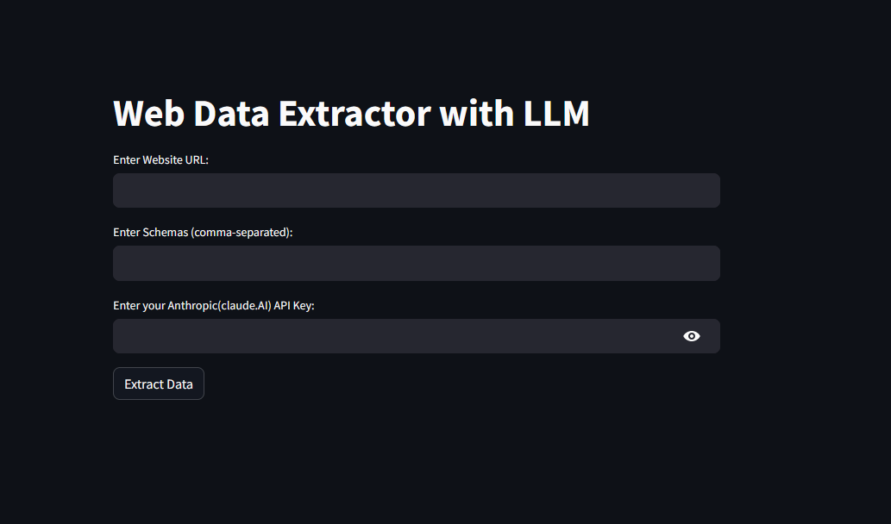

# AI-schema-extractor

This project is a web data extractor that uses the Anthropic API to extract specified schemas from a given website. The application is built with Python and Streamlit.

To Use the app. [Click here](https://ai-schema-extractor-by-sanjidhossain.streamlit.app/)


<br/>

## Features

- Extracts specified schemas from a given website URL.
- Uses the Anthropic API for schema extraction.
- Built with Streamlit for an easy-to-use web interface.

## Installation

1. Clone this repository:
    ```bash
    git clone https://github.com/SanjidHossain/AI-schema-extractor.git
    ```
2. Install the required packages:
    ```bash
    pip install -r requirements.txt
    ```
3. Set your Anthropic API key as an environment variable:
    ```bash
    export ANTHROPIC_API_KEY=your_api_key
    ```

## Usage

1. Run the Streamlit application:
    ```bash
    streamlit run app.py
    ```
2. Open the application in your web browser at `http://localhost:8501`.
3. Enter the website URL and schemas you want to extract.
4. Click the "Extract Data" button to extract the data.

## Contributing

Contributions are welcome! Please read the contributing guidelines first.

